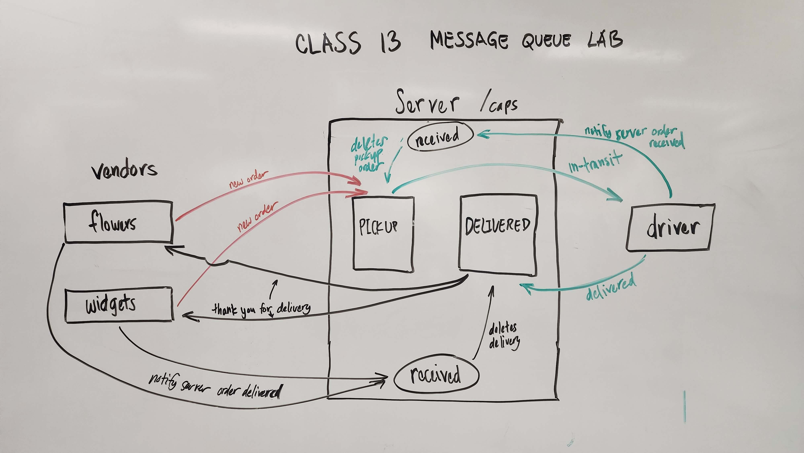

# Code Academy Parcel Service

1. **Phase 1: Event Driven Applications**
2. **Phase 2: SocketIO** 
3. **Phase 3: Message Queue** 
> Begin the build of an application for a product called CAPS - The Code Academy Parcel Service. In this sprint, we’ll build out a system that emulates a real world supply chain. CAPS will simulate a delivery service where vendors (such a flower shops) will ship products using our delivery service and when our drivers deliver them, each vendor will be notified that their customers received what they purchased.

## Installation

> Start with: `npm install`

## Usage

> To test, use: `npm test`

> Set your PORT environment with an .env file

```text
PORT=3001
SERVER_URL={localhost or SERVER URL}
```

## UML Diagram



## PR link
[PR link Class 13](https://github.com/cleecoloma/code-academy-parcel-service/pull/3)
[PR link Class 12](https://github.com/cleecoloma/code-academy-parcel-service/pull/2)
[PR link Class 11](https://github.com/cleecoloma/code-academy-parcel-service/pull/1)

## Contributors
* Chester Lee Coloma
* ChatGPT helped with the emit tests